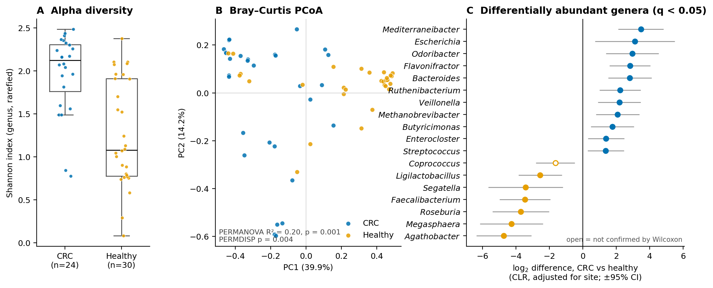
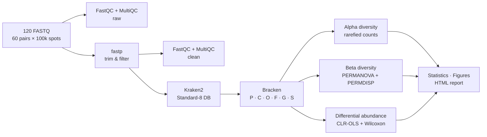

<div align="center">

# Gut Microbiome Signatures of Colorectal Cancer

**Shotgun metagenomic re-analysis of the Gupta et al. (2019) Indian CRC cohort — 30 cases, 30 controls**

-0072B2)


</div>

---

## TL;DR

| | Finding | Evidence |
|---|---|---|
| 🧬 | **The flavonoid-degrading *Flavonifractor plautii* is enriched in CRC** — the headline result of the original study, recovered independently here | present in 50 % of CRC vs 3 % of controls; q = 4×10⁻⁴ (CLR model), q = 9×10⁻⁴ (Wilcoxon) |
| 🌾 | **Butyrate producers are depleted in CRC**: *Agathobacter*, *Roseburia*, *Faecalibacterium* | log₂ difference −3.5 to −4.7, all q ≤ 6×10⁻⁴ |
| 🦠 | ***Bacteroides*, *Parabacteroides distasonis*, *Escherichia*, *Veillonella* and *Methanobrevibacter* are enriched in CRC** | 11 of 18 significant genera higher in CRC |
| 📊 | **Community composition differs** between groups | Bray–Curtis PERMANOVA R² = 0.20, p = 0.001 (site-stratified) |
| ⚠️ | **Disease is fully confounded with sequencing batch** — every case and every control come from different BioProjects that were demonstrably processed differently | [see Limitations](#limitations) |

> **Bottom line.** The direction of the taxonomic shifts agrees with the original study and with the wider CRC literature, but in this dataset they **cannot be separated from batch effects**. Treat them as hypotheses for a properly designed cohort, not as disease effects.

<p align="center">
  
</p>

<sub><b>Figure 1.</b> <b>A</b> Shannon diversity of genus-level Bracken counts rarefied to 2,899 reads (6 shallow CRC samples excluded; see <a href="#robustness-checks">robustness</a>). <b>B</b> PCoA of Bray–Curtis dissimilarities. <b>C</b> Site-adjusted CLR differences (log₂) with 95 % CI for all genera at q &lt; 0.05; filled points are also significant by Wilcoxon in the same direction. Regenerate with <code>python scripts/make_summary_figure.py</code>.</sub>

---

## Contents

[Study design](#study-design) · [Workflow](#workflow) · [Results](#results) · [Robustness checks](#robustness-checks) · [Limitations](#limitations) · [Reproducing](#reproducing) · [Outputs](#outputs) · [Türkçe özet](#türkçe-özet) · [Citation](#citation)

---

## Study design

| | CRC | Healthy |
|---|---|---|
| Bhopal | 15 | 15 |
| Kerala | 15 | 15 |
| BioProject | [PRJNA531273](https://www.ncbi.nlm.nih.gov/bioproject/PRJNA531273) | [PRJNA397112](https://www.ncbi.nlm.nih.gov/bioproject/PRJNA397112) |
| Platform | Illumina NextSeq 500, paired-end WGS | Illumina NextSeq 500, paired-end WGS |

- **Source study:** Gupta A, Dhakan DB, Maji A, *et al.* (2019). Association of *Flavonifractor plautii*, a flavonoid-degrading bacterium, with the gut microbiome of colorectal cancer patients in India. *mSystems* 4(6):e00438-19. [doi:10.1128/mSystems.00438-19](https://doi.org/10.1128/mSystems.00438-19). Sample → group/site mapping from Supplementary Table S1.
- **Subset analysed:** the **first** 100,000 SRA spots of each run (`fastq-dump --maxSpotId 100000`) — a fixed-depth, *non-random* subset, 1.11 GB in total. All 120 files are SHA-256 checksummed in `data/metadata/fastq_checksums.tsv`.
- **Design strength:** recruitment site is perfectly balanced (15/15/15/15), so site is adjusted for in every test.
- **Design weakness:** group ≡ BioProject. See [Limitations](#limitations).

---

## Workflow



| Step | Tool | Key settings |
|---|---|---|
| Quality control | FastQC 0.12.1 · MultiQC 1.35 | before and after trimming |
| Trimming | fastp 0.23.4 | Phred ≥ 20, ≤ 40 % low-quality bases, ≤ 5 N, length ≥ 50 bp, PE adapter detection |
| Host removal | — | **not run** (GRCh38 index unavailable); human reads were < 0.1 % of classified reads |
| Classification | Kraken2 2.17 | Standard-8 database (2026-06-26), confidence 0.1, minimum hit groups 3, memory-mapped |
| Abundance re-estimation | Bracken 3.1 | read length 150, threshold 10 reads, six ranks |
| Alpha diversity | Shannon · Simpson · Observed | genus, rarefied to 10th-percentile depth (seed 42); Kruskal–Wallis, BH-FDR |
| Beta diversity | Bray–Curtis · Jaccard | PCoA, NMDS; PERMANOVA 999 permutations **within site**; PERMDISP |
| Differential abundance | CLR + OLS | `CLR(counts + 0.5) ~ group + site` per taxon; prevalence ≥ 10 %, mean ≥ 10⁻⁴; BH-FDR. Sensitivity: Wilcoxon on proportions |
| Functional profiling | — | **not run** (HUMAnN3 database ~30 GB; depth too low for pathways) |

---

## Results

### Sequencing and classification

| Metric | Value |
|---|---|
| Reads after fastp | 11,500,972 / 12,000,000 (95.8 %) |
| Read pairs classified by Kraken2 | 1.7–19.1 % per sample (CRC 8.2 ± 4.7 %, healthy 7.5 ± 2.1 %) |
| Classified pairs per sample | median 7,324 (range 1,650–19,091) |
| Bacterial share of classified reads | ≈ 97 % |
| *Homo sapiens* share of all reads | 0.05 % (CRC) · 0.09 % (healthy) |
| Dominant genera (mean relative abundance) | *Segatella* 32.1 % · *Bacteroides* 15.6 % · *Phocaeicola* 8.3 % |

### Diversity

| Measure | CRC (n = 24) | Healthy (n = 30) | Test | q |
|---|---|---|---|---|
| Shannon | 1.97 ± 0.47 | 1.27 ± 0.62 | Kruskal–Wallis | 7×10⁻⁵ |
| Simpson | 0.76 ± 0.13 | 0.50 ± 0.24 | Kruskal–Wallis | 6×10⁻⁵ |
| Observed genera | 22.1 ± 5.6 | 15.6 ± 5.1 | Kruskal–Wallis | 7×10⁻⁵ |

| Distance | PERMANOVA F | R² | p | PERMDISP p |
|---|---|---|---|---|
| Bray–Curtis | 14.10 | 0.196 | 0.001 | 0.004 |
| Jaccard | 6.52 | 0.101 | 0.001 | 0.004 |

Higher diversity in CRC is unusual relative to the wider literature. Here it is driven by the control group: *Segatella copri* — typical of fibre-rich, non-Westernised diets — makes up on average 54 % of control communities versus 10 % in CRC, lowering control evenness. Both groups also differ in within-group spread (PERMDISP), so the PERMANOVA signal is partly dispersion.

### Differentially abundant taxa

Site-adjusted CLR model, q < 0.05. **18 / 51 genera** and **20 / 65 species** were significant; **17** in each set were confirmed by Wilcoxon with the same direction (✓).

<details open>
<summary><b>Genera</b></summary>

| Genus | log₂ diff. (95 % CI) | q (CLR) | q (Wilcoxon) | Prevalence CRC / healthy | |
|---|---|---|---|---|---|
| ***Higher in CRC*** | | | | | |
| *Mediterraneibacter* | +3.47 (2.12, 4.83) | 1×10⁻⁴ | 6×10⁻⁴ | 63 % / 10 % | ✓ |
| *Escherichia* | +3.11 (0.73, 5.49) | 0.042 | 0.021 | 40 % / 10 % | ✓ |
| *Odoribacter* | +2.96 (1.38, 4.54) | 0.003 | 0.002 | 60 % / 20 % | ✓ |
| *Flavonifractor* | +2.83 (1.61, 4.05) | 4×10⁻⁴ | 9×10⁻⁴ | 50 % / 3 % | ✓ |
| *Bacteroides* | +2.82 (1.51, 4.12) | 6×10⁻⁴ | 7×10⁻⁴ | 100 % / 87 % | ✓ |
| *Ruthenibacterium* | +2.23 (1.00, 3.45) | 0.004 | 0.002 | 43 % / 3 % | ✓ |
| *Veillonella* | +2.19 (0.92, 3.47) | 0.006 | 0.005 | 43 % / 7 % | ✓ |
| *Methanobrevibacter* | +2.09 (0.79, 3.39) | 0.011 | 0.002 | 43 % / 3 % | ✓ |
| *Butyricimonas* | +1.77 (0.48, 3.06) | 0.032 | 0.010 | 43 % / 10 % | ✓ |
| *Enterocloster* | +1.39 (0.30, 2.48) | 0.045 | 0.010 | 27 % / 0 % | ✓ |
| *Streptococcus* | +1.38 (0.29, 2.46) | 0.045 | 0.006 | 30 % / 0 % | ✓ |
| ***Higher in healthy*** | | | | | |
| *Agathobacter* | −4.72 (−6.36, −3.07) | 3×10⁻⁵ | 0.002 | 20 % / 73 % | ✓ |
| *Megasphaera* | −4.26 (−6.15, −2.38) | 4×10⁻⁴ | 0.006 | 33 % / 77 % | ✓ |
| *Roseburia* | −3.70 (−5.39, −2.01) | 6×10⁻⁴ | 0.009 | 30 % / 73 % | ✓ |
| *Faecalibacterium* | −3.45 (−4.97, −1.93) | 4×10⁻⁴ | 0.0498 | 60 % / 97 % | ✓ |
| *Segatella* | −3.42 (−5.65, −1.19) | 0.016 | 6×10⁻⁴ | 83 % / 83 % | ✓ |
| *Ligilactobacillus* | −2.55 (−3.85, −1.25) | 0.002 | 0.011 | 7 % / 37 % | ✓ |
| *Coprococcus* | −1.64 (−2.80, −0.48) | 0.028 | 0.106 | 10 % / 33 % | |

</details>

<details>
<summary><b>Species</b></summary>

| Species | log₂ diff. | q (CLR) | q (Wilcoxon) | Prevalence CRC / healthy | |
|---|---|---|---|---|---|
| ***Higher in CRC*** | | | | | |
| *Parabacteroides distasonis* | +4.10 | 8×10⁻⁵ | 4×10⁻⁴ | 67 % / 10 % | ✓ |
| *Bacteroides thetaiotaomicron* | +3.22 | 4×10⁻⁴ | 0.002 | 67 % / 20 % | ✓ |
| *Odoribacter splanchnicus* | +2.89 | 0.002 | 0.003 | 60 % / 20 % | ✓ |
| ***Flavonifractor plautii*** | **+2.77** | **4×10⁻⁴** | **9×10⁻⁴** | **50 % / 3 %** | ✓ |
| *Phocaeicola vulgatus* | +2.76 | 0.046 | 0.031 | 80 % / 47 % | ✓ |
| *Bacteroides eggerthii* | +2.73 | 0.002 | 9×10⁻⁴ | 43 % / 0 % | ✓ |
| *Bacteroides hominis* | +2.31 | 0.022 | 0.010 | 33 % / 3 % | ✓ |
| *Ruthenibacterium lactatiformans* | +2.20 | 0.004 | 0.003 | 43 % / 3 % | ✓ |
| *Bacteroides intestinalis* | +2.08 | 0.015 | 0.004 | 33 % / 0 % | ✓ |
| *Butyricimonas virosa* | +1.50 | 0.018 | 0.004 | 33 % / 0 % | ✓ |
| *Enterocloster bolteae* | +1.29 | 0.046 | 0.011 | 27 % / 0 % | ✓ |
| ***Higher in healthy*** | | | | | |
| *Megasphaera* sp. | −4.82 | 2×10⁻⁴ | 0.003 | 20 % / 70 % | ✓ |
| *Agathobacter rectalis* | −4.82 | 4×10⁻⁵ | 0.002 | 20 % / 73 % | ✓ |
| *Roseburia faecis* | −4.66 | 7×10⁻⁶ | 4×10⁻⁴ | 10 % / 67 % | ✓ |
| *Segatella copri* | −3.68 | 0.015 | 5×10⁻⁴ | 80 % / 83 % | ✓ |
| *Bifidobacterium adolescentis* | −2.98 | 0.006 | 0.046 | 10 % / 37 % | ✓ |
| *Faecalibacterium prausnitzii* | −2.91 | 0.021 | 0.072 | 30 % / 57 % | |
| *Ligilactobacillus ruminis* | −2.84 | 7×10⁻⁴ | 0.006 | 3 % / 37 % | ✓ |
| *Segatella hominis* | −2.77 | 0.039 | 0.118 | 27 % / 50 % | |
| *Coprococcus* sp. ART55/1 | −1.42 | 0.038 | 0.118 | 3 % / 20 % | |

</details>

Full tables (effect, SE, p, q, means, prevalences, sensitivity columns): [`results/differential_abundance/`](results/differential_abundance).

### Interpretation

- **Replication of the index finding.** *F. plautii*, which degrades dietary flavonoids, was the signature taxon reported by Gupta *et al.* It is recovered here from only 100,000 read pairs per sample, with two independent tests.
- **Loss of butyrate producers.** *Agathobacter rectalis*, *Roseburia faecis* and *Faecalibacterium prausnitzii* ferment fibre to butyrate, the main energy source of colonocytes. Their depletion in CRC is one of the most consistent observations across CRC metagenome studies (Wirbel *et al.* 2019; Thomas *et al.* 2019).
- **Not detected.** *Fusobacterium nucleatum*, *Peptostreptococcus* and *Parvimonas* — the best-replicated CRC markers in multi-cohort meta-analyses — were absent from the tested taxa at this depth. This is a sensitivity limit, not evidence of absence.

---

## Robustness checks

| Concern | Check | Outcome |
|---|---|---|
| Rarefaction dropped 6 samples, **all CRC** | Alpha diversity re-run at minimum depth (1,398 reads, all 60 samples kept) — `scripts/alpha_rarefaction_sensitivity.py` | Same direction; all q ≤ 5×10⁻⁴ |
| Site differences inflating group effects | PERMANOVA permutations restricted within site; site as covariate in the CLR model | Applied to all reported results |
| Method dependence of DA | Second, non-parametric method on the same taxa | 17/18 genera and 17/20 species concordant |
| PERMANOVA driven by dispersion | PERMDISP | Dispersion differs (p = 0.004) — reported, not hidden |
| Truncated intermediate files | Every trimmed FASTQ re-counted against its fastp JSON | 60/60 match |
| Pipeline correctness | Unit tests incl. synthetic confounding and dispersion cases | 67/67 passing |

---

## Limitations

1. **Disease is confounded with batch.** All CRC samples come from PRJNA531273 and all controls from PRJNA397112. The raw reads show that the two projects were processed differently ([`results/tables/fastp_metrics_by_group.tsv`](results/tables/fastp_metrics_by_group.tsv)):

   | Raw-read metric | CRC | Healthy | Mann–Whitney p |
   |---|---|---|---|
   | Reads removed by fastp | 0.001 % | 8.3 % | 2×10⁻¹¹ |
   | Q30 rate before trimming | 0.868 | 0.764 | 9×10⁻¹⁰ |
   | Mean R1 length before trimming | 139.3 bp | 134.7 bp | 7×10⁻⁴ |

   CRC reads appear to have been quality-filtered before upload. No statistical adjustment can separate disease from batch in this design.
2. **Shallow, non-random subset.** 100,000 spots per sample (first spots, not random); 1,650–19,091 classified pairs. Rare taxa and modest effects are missed.
3. **Low classification rate.** The 8 GB-capped database and confidence 0.1 classify ~8 % of pairs; South Asian gut taxa are under-represented in reference genomes. Abundances describe the classified fraction only.
4. **No host-read removal and no functional profiling.**
5. **Covariates.** Site is balanced and adjusted for; age and sex are not modelled.
6. **Compositionality.** CLR differences are relative to each sample's geometric mean, not changes in absolute bacterial load.

---

## Reproducing

**Requirements:** Python ≥ 3.10 with [`requirements.txt`](metagenomics-microbiome-script/requirements.txt), FastQC, MultiQC, fastp, Kraken2, Bracken, and ~8 GB free disk for the database.

```bash
# 1. Kraken2 Standard-8 database — streamed, no archive kept (~7.6 GB on disk)
mkdir -p data/db/k2_standard_08_GB_20260626
curl -L https://genome-idx.s3.amazonaws.com/kraken/k2_standard_08_GB_20260626.tar.gz \
  | tar -xzf - -C data/db/k2_standard_08_GB_20260626

# 2. (optional) re-download the 100k-spot subset
python scripts/prepare_crc_subset.py --max-spots 100000 --workers 4

# 3. Run everything from the project root
python metagenomics-microbiome-script/main.py --config config/config.yaml --validate
python metagenomics-microbiome-script/main.py --config config/config.yaml

# 4. Supplementary analyses and the README figure
python scripts/batch_qc_summary.py
python scripts/alpha_rarefaction_sensitivity.py
python scripts/make_summary_figure.py
```

- **Interrupted?** Add `--resume`: completed fastp, FastQC, Kraken2 and Bracken outputs are reused, and partial files are never mistaken for complete ones.
- **Less than 8 GB RAM?** Keep `taxonomy.memory_mapping: true` (≈ 1.7 min per sample).
- **macOS:** `scripts/run_kraken2_mac.sh` installs Kraken2 via Homebrew if needed and runs the classification step natively and resumably. Then continue with `--resume`.

<details>
<summary><b>Environment of this run (2026-10-05)</b></summary>

| Component | Version |
|---|---|
| Pipeline | metagenomics-microbiome-script 1.1.0 ([CHANGELOG](metagenomics-microbiome-script/CHANGELOG.md)) |
| FastQC / MultiQC / fastp | 0.12.1 / 1.35 / 0.23.4 |
| Kraken2 | 2.17.1 (Linux, 1 sample) and Homebrew build (macOS, 59 samples); identical settings |
| Bracken | 3.1 |
| Kraken2 DB | `k2_standard_08_GB_20260626` |
| Python | 3.10.12 · numpy 2.2.6 · pandas 2.3.3 · scipy 1.15.3 · statsmodels 0.15.0 · scikit-learn 1.7.2 · matplotlib 3.10.9 |
| Seeds | rarefaction 42 · PERMANOVA/PERMDISP 42 |

All steps were re-run from scratch for this release. The bugs found and fixed along the way (rarefaction ignored by alpha diversity, mislabelled "ANCOM-BC", unparsed Kraken2 rates, non-functional `--resume`, truncated-file reuse, and others) are documented in the [pipeline CHANGELOG](metagenomics-microbiome-script/CHANGELOG.md).

</details>

---

## Outputs

| Path | Content |
|---|---|
| [`results/reports/report_latest.html`](results/reports/report_latest.html) | Self-contained HTML report (all figures, tables, methods, limitations) |
| [`results/figures/`](results/figures) | Publication figures (PNG + PDF): composition, heatmap, alpha, PCoA/NMDS, volcano, DA bars, rarefaction, summary |
| [`results/differential_abundance/`](results/differential_abundance) | Per-taxon results, genus and species |
| [`results/taxonomy/tables/`](results/taxonomy/tables) | Relative abundance and read-count matrices (6 ranks), Kraken2 classification stats |
| [`results/diversity/`](results/diversity) | Alpha values, distance matrices, ordination coordinates, rarefied counts |
| [`results/statistics/`](results/statistics) | Alpha group tests, per-taxon Kruskal–Wallis, key findings |
| [`results/tables/`](results/tables) | fastp batch metrics, alpha rarefaction sensitivity |
| `results/qc/{pre,post}/multiqc/` | MultiQC reports |

---

## Türkçe özet

**Soru:** Kolon kanseri hastalarının bağırsak bakterileri sağlıklı insanlarınkinden farklı mı?

**Veri:** Hindistan'dan 30 kolon kanseri hastası ve 30 sağlıklı bireyin dışkı metagenomları (Gupta ve ark., 2019). Her örnekten ilk 100 bin okuma çifti kullanıldı.

**Bulgular:**
- Makalenin ana bulgusu olan ***Flavonifractor plautii*** bu analizde de hastalarda artmış çıktı: hastaların %50'sinde, sağlıklıların %3'ünde var.
- Lifleri bütirata çeviren faydalı bakteriler (*Agathobacter*, *Roseburia*, *Faecalibacterium*) hastalarda azalmış.
- İki grubun bakteri topluluğu birbirinden belirgin şekilde farklı.

**En önemli uyarı:** Hasta ve sağlıklı örnekler iki ayrı projeden geliyor ve farklı işlenmiş. Bu yüzden görülen farkların hastalıktan mı yoksa teknik farktan mı kaynaklandığı ayrılamıyor. Sonuçlar keşif niteliğinde. Doğrulamak için iyi tasarlanmış, daha derin dizilenmiş bir çalışma gerekiyor.

---

## Citation

If you use this analysis, please cite the original study and the tools:

- Gupta A *et al.* (2019) *mSystems* 4:e00438-19 — data and study design
- Wood DE, Lu J, Langmead B (2019) *Genome Biol* 20:257 — Kraken2
- Lu J *et al.* (2017) *PeerJ Comput Sci* 3:e104 — Bracken
- Chen S *et al.* (2018) *Bioinformatics* 34:i884 — fastp
- Anderson MJ (2001) *Austral Ecol* 26:32; (2006) *Biometrics* 62:245 — PERMANOVA, PERMDISP
- Aitchison J (1982) *J R Stat Soc B* 44:139 — CLR transform
- Wirbel J *et al.* (2019) *Nat Med* 25:679; Thomas AM *et al.* (2019) *Nat Med* 25:667 — CRC metagenome meta-analyses (context)

The full reference list is in the HTML report.

<sub>Analysis by Alperen · Molecular Biology and Genetics, Uşak University · 2026</sub>
